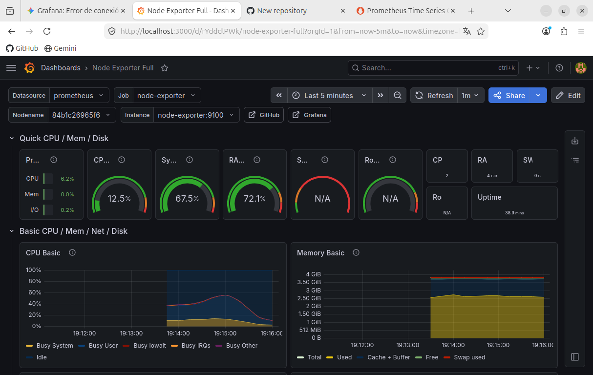

# Stack de Monitorización Local con Docker

Este proyecto contiene la configuración necesaria para desplegar un entorno de monitorización completo utilizando contenedores Docker.

## Tecnologías Utilizadas
* Docker y Docker Compose
* Grafana
* Prometheus
* Node Exporter

## Captura del Dashboard

## Cómo desplegar este laboratorio
1. Clona este repositorio o descarga el archivo `docker-compose.yml`.
2. Ejecuta el siguiente comando en la misma ruta donde esté el archivo:
   `docker compose up -d`
3. Accede a Grafana a través de `http://localhost:3000`.
4. Configura Prometheus como Data Source utilizando la URL de la red interna de los contenedores (`http://prometheus:9090`).
